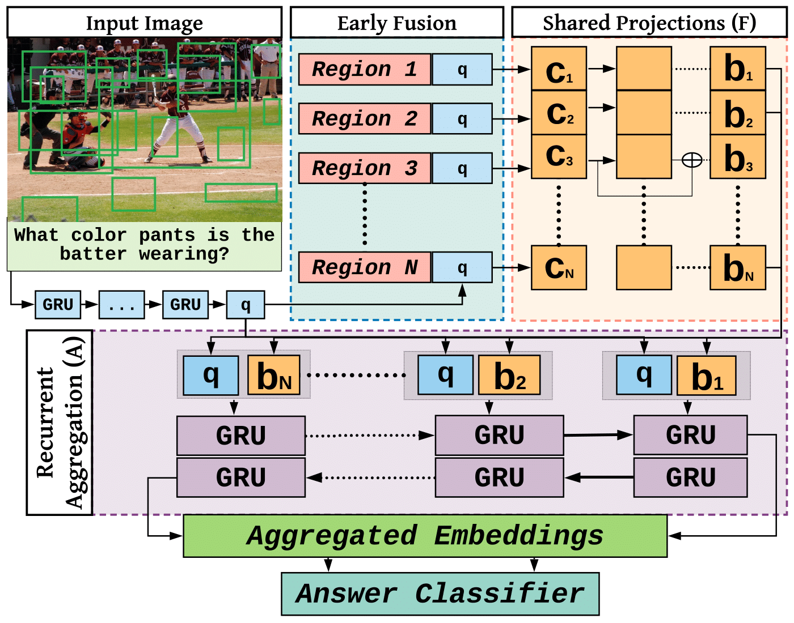

# Answer Them All! Toward Universal Visual Question Answering Models

This is a pytorch implementation of our Recurrent Aggregation of Multimodal Embeddings Network (RAMEN) from our [CVPR-2019 paper](https://arxiv.org/abs/1903.00366).

## Method


## Usage

#### Setting up visual features for VQA2, CVQA, VQACP and TDIUC
Let ```ROOT``` be the directory where all data/code/results will be placed. ```DATA_ROOT=${ROOT}/${DATASET}```, where ```DATASET``` has one of the following values: VQA, CVQA, VQACP or TDIUC 

1. Download train+val features into ```${DATA_ROOT}``` [using this link](https://imagecaption.blob.core.windows.net/imagecaption/trainval_36.zip) so that you have this file: ```${DATA_ROOT}/trainval_36.zip```

2. Extract the zip file, so that you have ```${DATA_ROOT}/trainval_36/trainval_resnet101_faster_rcnn_genome_36.tsv```

3. Download test features into ```${DATA_ROOT}``` [using this link](https://imagecaption.blob.core.windows.net/imagecaption/test2015_36.zip)

4. Extract the zip file, so that you have ```${DATA_ROOT}/test2015_36/test2015_resnet101_faster_rcnn_genome_36.tsv```

5. Execute the following script to extract the zip files and create hdf5 files ```./tsv_to_h5.sh``` 
    - Train and val features are extracted to ```${DATA_ROOT}/features/trainval.hdf5```. The script will create softlinks ```train.hdf5``` and ```val.hdf5```, pointing to ```trainval.hdf5```.
    - Test features are extracted to ```${DATA_ROOT}/features/test.hdf5```

6. Create symbolic links for `test_dev` split, which point to `test` files:
    - ```${DATA_ROOT}/features/test_dev.hdf5```, pointing to ```${DATA_ROOT}/features/test.hdf5```
    - ```${DATA_ROOT}/features/test_dev_ids_map.json```, pointing to ```${DATA_ROOT}/features/test_ids_map.json```

7. The features for additional images present in TDIUC are not present in the above files, so please refer to TDIUC section to set up those extra features.

### VQA2
##### Training
1. Download questions and annotations from [this link](https://visualqa.org/download.html).
2. Rename question and annotation files to ```${SPLIT}_questions.json``` and ```${SPLIT}_annotations.json``` and copy them to ```$ROOT/VQA2/questions```.  
    - You should have ```train_questions.json```, ```train_annotations.json```, ```val_questions.json```, ```val_annotations.json```, ```test_questions.json``` and ```test_dev_questions.json``` inside ```$ROOT/VQA2/questions```   
3. Download [glove.6B.zip](http://nlp.stanford.edu/data/glove.6B.zip), extract it and copy ```glove.6B.300d.txt``` to ```${DATA_ROOT}/glove/```
4. Execute ```./ramen_VQA2.sh```. This will first preprocess all questions+annotations files and then start training the model.

### CLEVR

##### Extract bottom-up features for CLEVR
We have provided a [pre-trained FasterRCNN model](https://github.com/erobic/faster_rcnn_1_11_34999/raw/master/faster_rcnn_1_11_34999.pth) and feature extraction script in a [separate repository](https://github.com/erobic/faster-rcnn.pytorch) to extract bottom-up features for CLEVR. 

Please refer to the README file of that repository for detailed instructions to extract the features.

##### Preprocess and Train on CLEVR
1. Download the question files from [this link](https://dl.fbaipublicfiles.com/clevr/CLEVR_v1.0_no_images.zip)
2. Copy all of the question files to ```${ROOT}/CLEVR/questions```. 
    - You should now have the following files ```CLEVR_train_questions.json```, ```CLEVR_val_questions.json``` inside ```$ROOT/CLEVR/questions/```

3. Download [glove.6B.zip](http://nlp.stanford.edu/data/glove.6B.zip), extract it and copy ```glove.6B.300d.txt``` to ```${ROOT}/CLEVR/glove/```

##### Execute ```./scripts/ramen_CLEVR.sh``` 

1. This script first converts the CLEVR files into VQA2-like format.
2. Then it creates dictionaries for the dataset.
3. Finally it starts the training. 

##### Testing on pre-trained model
1. Download pre-trained model from []() and put it into ```${ROOT}/RAMEN_CKPTS```
2. Execute ```./scripts/ramen_CLEVR_test.sh```

## Citation
```
@InProceedings{shrestha2019answer,
    author = {Shrestha, Robik and Kafle, Kushal and Kanan, Christopher},
    title = {Answer Them All! Toward Universal Visual Question Answering Models},
    booktitle = {CVPR},
    year = {2019}
}
```